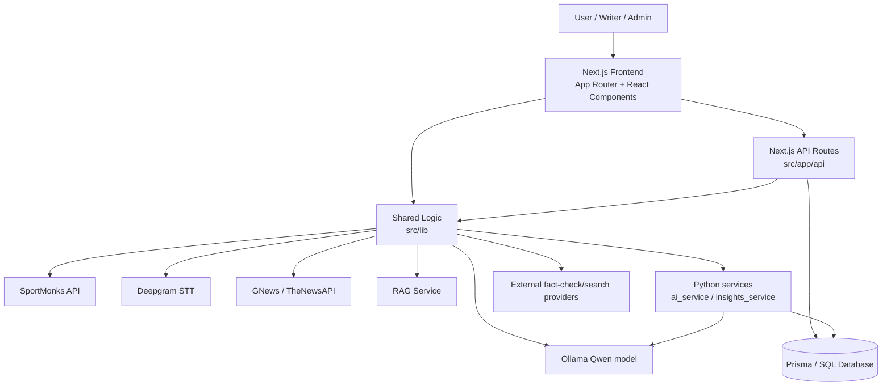

# 01-ARCHITECTURE

## System overview

CricGeek is a full-stack cricket platform with a Node/Next.js application and auxiliary Python services. The main user-facing application runs through the Next.js App Router in src/app. The app consumes live cricket data, handles blog and commentary flows, and integrates with language-model-based quality and analysis services.

The architecture is best understood as:

USER
↓
Next.js frontend (App Router)
↓
Route handlers and server actions
↓
Prisma + database
↓
External cricket and AI providers
↓
Python AI services for advanced features

## High-level architecture diagram

## Frontend layer

The frontend is built with:

- Next.js 16
- React 19
- App Router pages under src/app
- Tailwind-style CSS via src/app/globals.css and component classes
- Session context via next-auth/react provider in src/app/providers.tsx

The app shell is defined in src/app/layout.tsx and includes:

- Navbar
- Footer
- Session provider
- main content wrapper

## Backend layer

The main backend is Next.js route handlers under src/app/api. Server files call Prisma for persistence and call external services for live match data, AI analysis, and fact checking.

Examples of the main backend responsibilities:

- blog read/write flow
- auth and session handling
- commentary lifecycle
- scoring pipeline
- leaderboard and writer profile updates
- contest moderation
- live and historical match analysis

## Shared logic layer

The src/lib folder contains most reusable logic:

- auth.ts — NextAuth and credentials/Google provider setup
- db.ts — Prisma client singleton
- cricket-api.ts — SportMonks or legacy fallback fetches
- scoring.ts — BQS/quality pipeline and writer DNA logic
- fact-check.ts — claim extraction and fact checking
- historical-warehouse.ts — structured historical match analysis
- internal-originality.ts — internal duplicate detection
- deepgram.ts — speech-to-text integration
- commentary-* files — commentary tempo and formatting

## Python services layer

There are dedicated Python directories:

- ai_service/
- insights_service/

These are not just helper scripts; they provide service endpoints for AI tasks and analysis flows. The Node app often reaches these via environment-driven service URLs in src/lib/ai-service.ts and via AI_SERVICE_URL / T20_INSIGHTS_URL.

## Data flow by domain

### Match content flow

- User navigates to a match page or home page
- Frontend calls match APIs
- src/lib/cricket-api.ts resolves data source (SportMonks first, fallback to legacy API, then mock mode)
- Results are normalized into the app's Match/Scorecard types
- UI displays scorecards, commentary, squads, and analysis

### Blog publishing flow

- User writes a blog in src/app/blog/write/page.tsx
- Client triggers AI tag generation and optional polishing
- Route POST /api/blogs creates a post
- Embedding generation runs for internal originality checks
- Scoring pipeline computes BQS and related metrics
- Blog score and writer profile are updated in Prisma

### Commentary flow

- User starts or joins a commentary session
- Session is recorded in Prisma
- Audio is transcribed through Deepgram or AI service proxy
- Player names are normalized and commentary text is polished
- Commentary entries are stored and served by API routes

## Implementation status notes

The architecture is coherent and modular, but there are several configuration-sensitive dependencies:

- live match data requires SportMonks token or fallback API keys
- AI analysis depends on Ollama being reachable and configured
- Python AI services must be available in production or local dev environments
- database provider setup is not fully consistent across files

## Architectural strengths

- Clear separation between pages, routes, and libs
- Strong service encapsulation around external APIs
- Prisma model layer gives a consistent persistence boundary
- AI workflows are modularized and partially isolated into separate services

## Architectural risks

- Environment-sensitive runtime dependencies make local setup brittle
- SQL Server vs MySQL configuration mismatch in schema/example env files
- Some features are tied to demo fallback logic rather than full production flows
- Large amount of AI logic is integrated across Node and Python code with implicit env assumptions
